# PROJEKT
## Zadanie 1 - OSINT
### Warszawski Uniwersytet Medyczny
1. Pobrałem plik ```index.html```, dzięki czemu zdobyłem adres IP strony.  
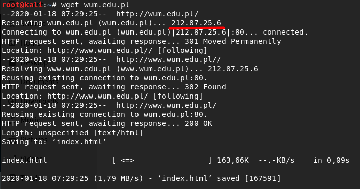  
2. W pliku ```index.html``` znalazłem także strony WUM na różnych serwisach  
  
3. Na stronie znalazłem adres organizacji, telefon centralny, faks a także numer *NIP* i *REGON*  
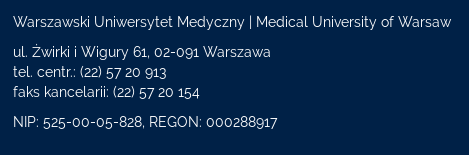  
4. Następnie znalazłem informacje o aktualnym rektorze, jego mail, a także życiorys wraz z zainteresowaniami zawodowymi i prywatnymi oraz znanymi mu językami i używane systemy operacyjne. Plik z życiorysem zamieszczam w repozytorium .  
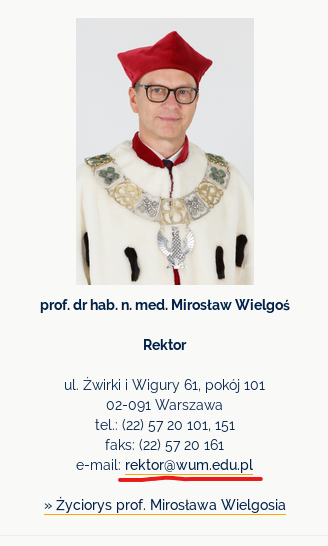  
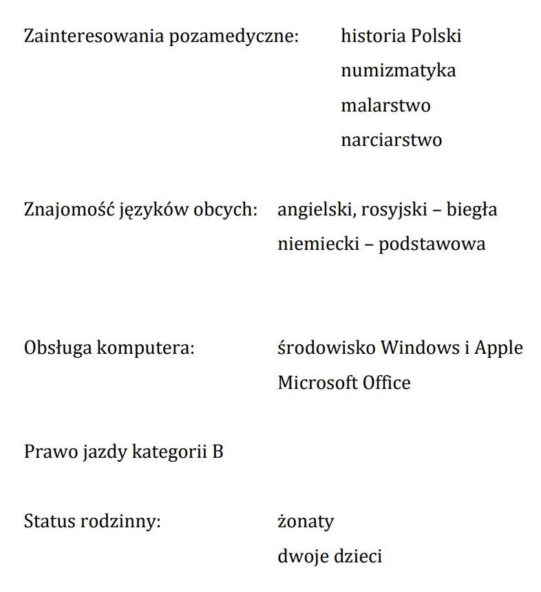  
5. Następnie znalazłem takie same informacje o wszystkich prorektorach  
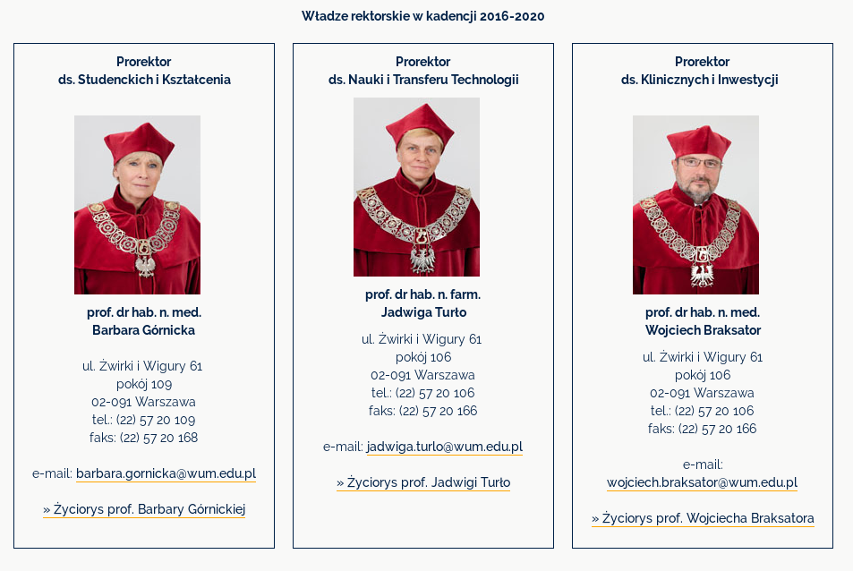  
  
6. Za pomocą narzędzia ```theharvester``` znalazłem kilkadziesiąt adresów mail oraz ponad dwieście subdomen wraz z ich adresami IP.  
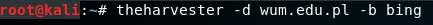  
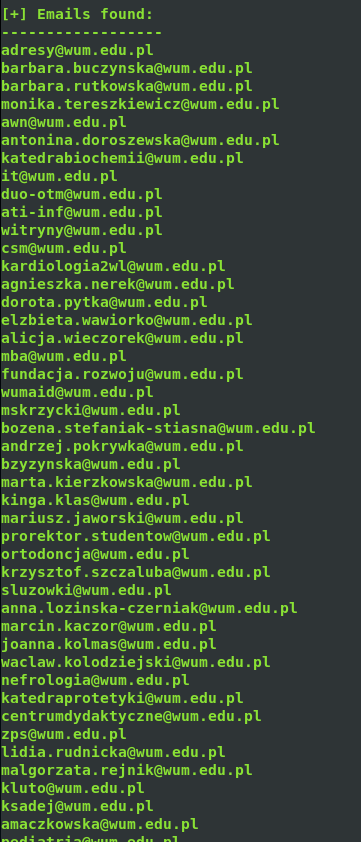  
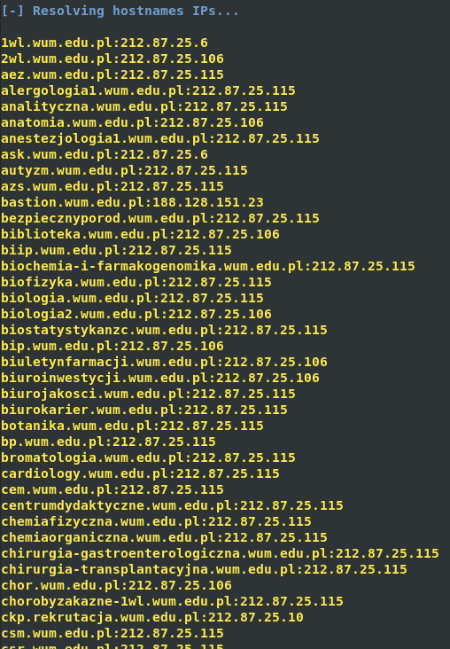  
7. Znalazłem liczbę wyników sybdomen w wyszukiwarce *Google*  
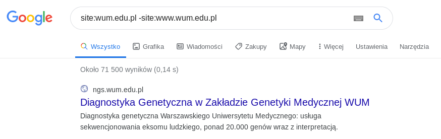  
8. Użyłem narzędzia ```whois``` do znalezienia zakresu IP dla sieci tej organizacji  
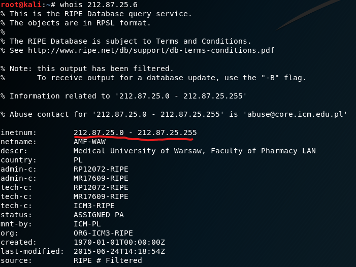  
9. Porównałem wyniki z bazą danych ```whois``` na stronie dns.pl/whois. Dzięki temu znalazłem nazwy i adresy IP ich serwerów, a także adres rejestratora.  
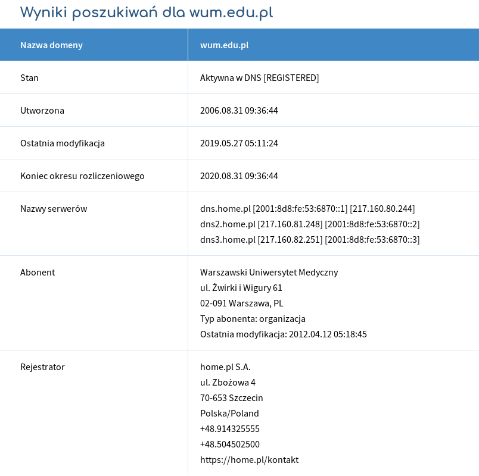  
10. Użyłem narzędzia ```netcraft``` i uzyskałem subdomeny, a także inne informacje takie jak używany algorytm hashowania (sha256)  
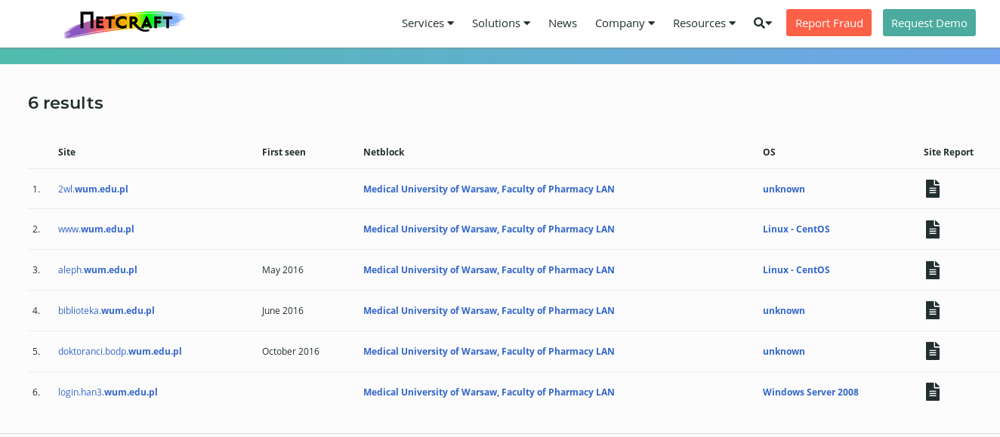  
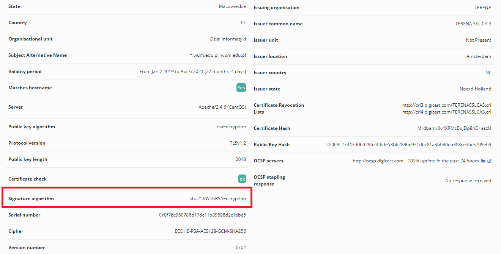  
11. Użyłem narzędzia ```shodan.io```, które znalazło pewne podatności i potwierdziło znalezioną wcześniej metodę hashowania  
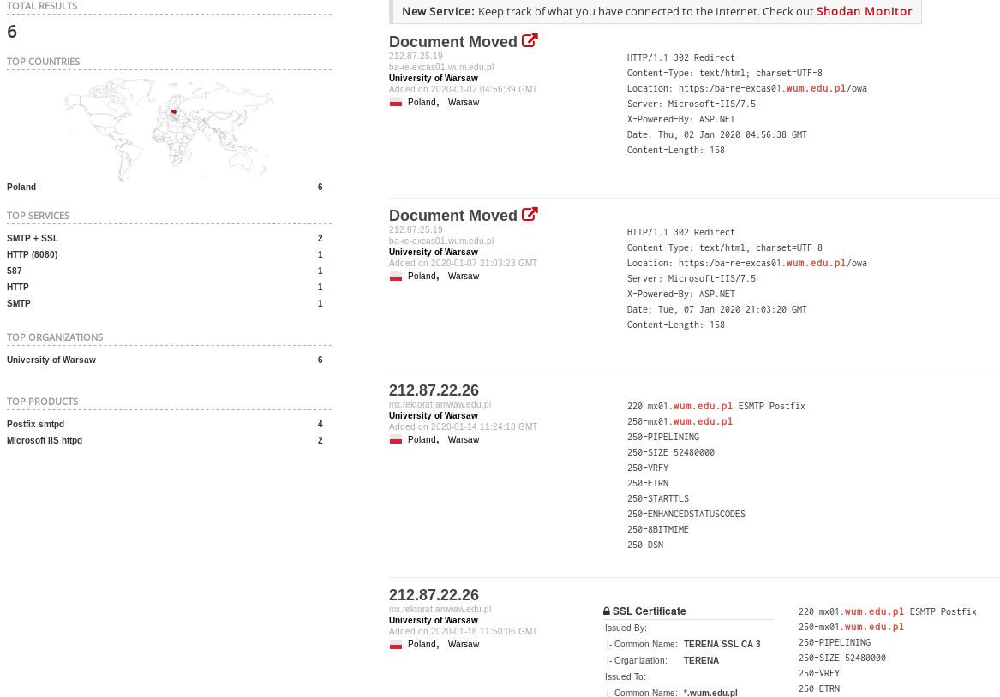  
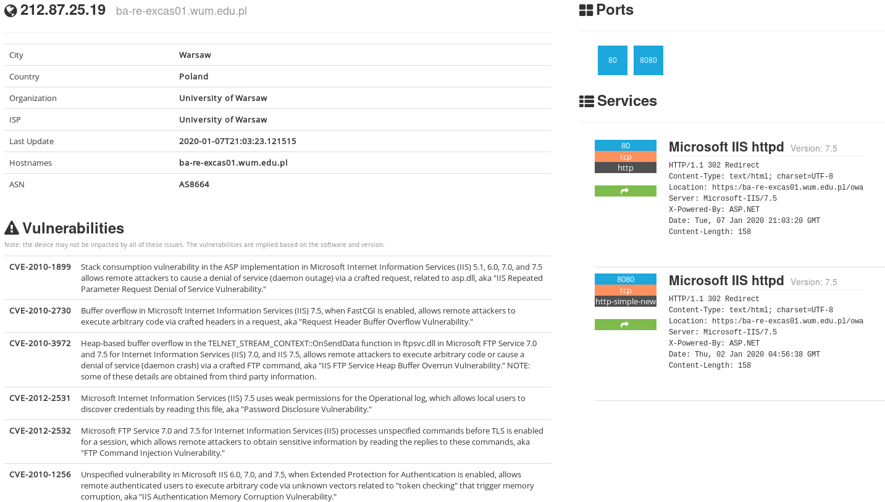  
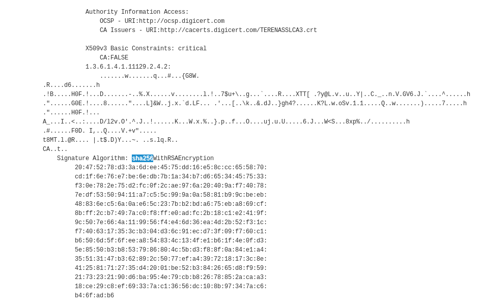  
12. Dzięki stronie archive.org znalazłem pierwszą wersję strony z 2007 roku, a także z kolejnych lat.
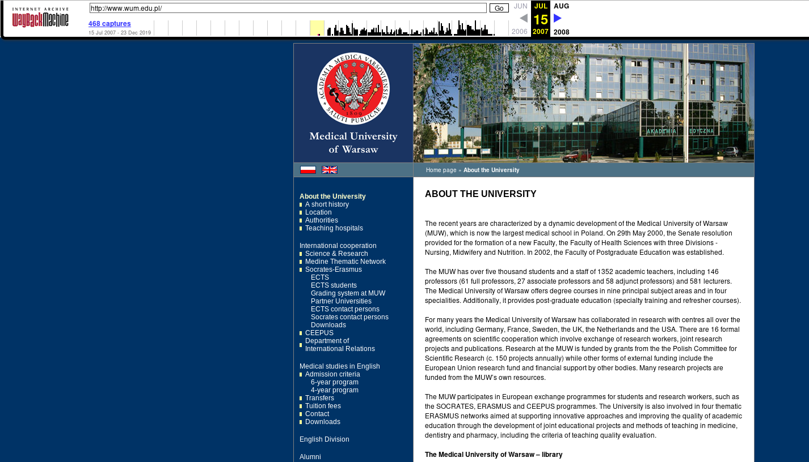  
13. Za pomocą narzędzia ```whois``` znalazłem prawdopodobną lokalizację geograficzną serwerów  
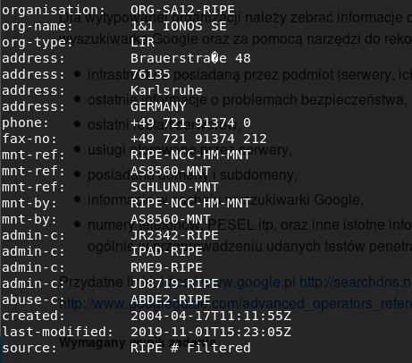  
14. Za pomocą polecenia ```cache:wum.edu.pl``` znalazłem informacje w cache'u wyszukiwarki *Google*  
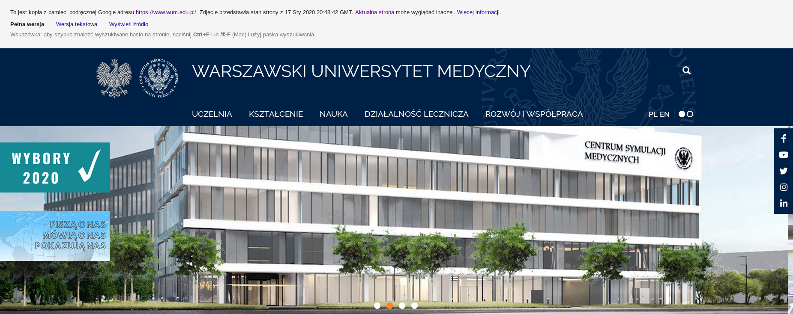  
15. Za pomocą skryptu *Bash* przeszukałem plik ```index.html``` w poszukiwaniu subdomen. Wykonałem także skanowanie za pomocą ```recon-ng```, uzyskując kolejne subdomeny wraz z ich adresami IP (w każdym źródle były pewnie subdomeny, których nie znalazłem za poomocą innych narzędzi)  
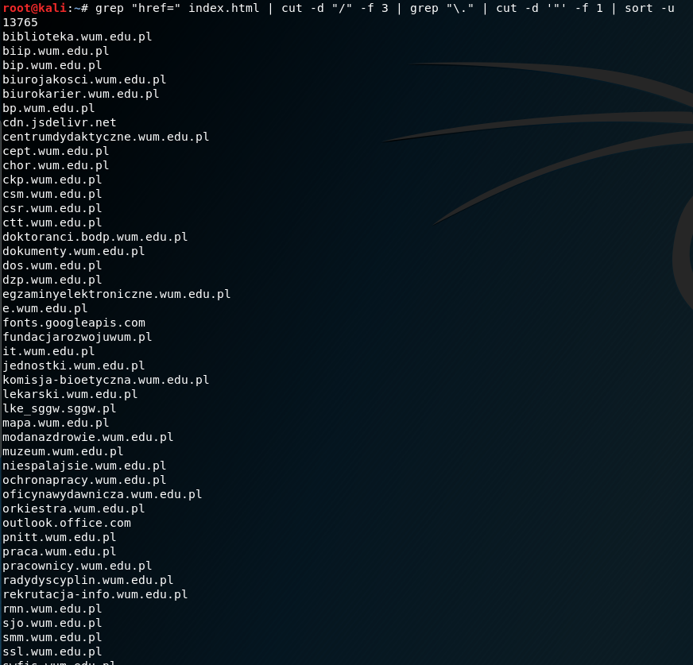  
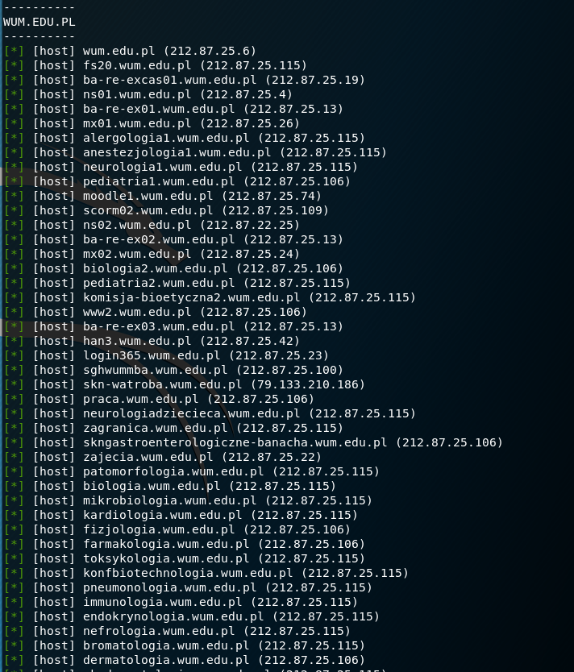  
cos tam
